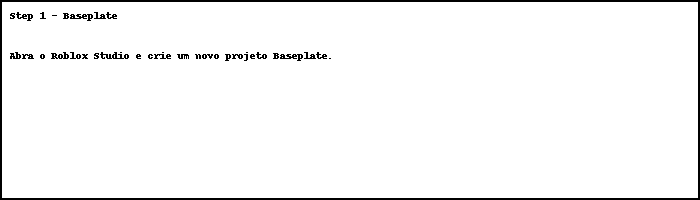
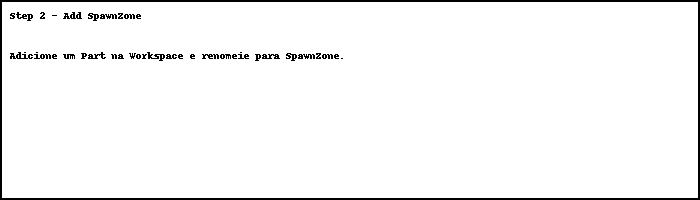
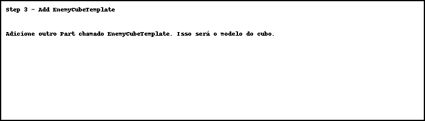
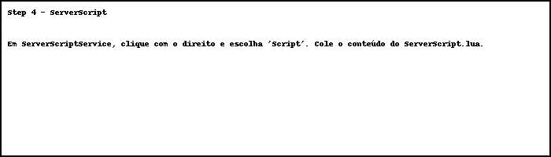
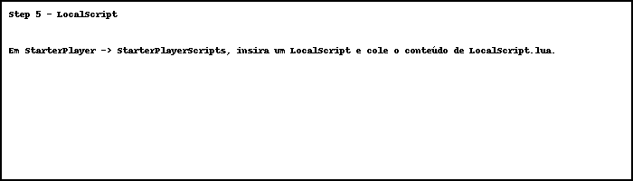
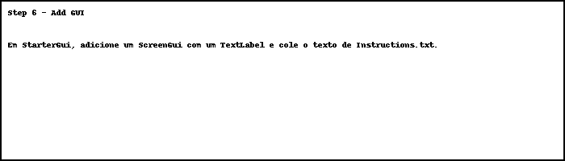
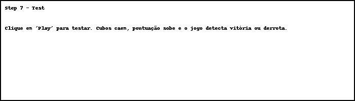

# Cube Invasion

A simple  game for Roblox Studio.

## 🎮 How it works

- Player moves to intercept falling cubes.
- If a cube touches the ground, the player loses a life.
- If 10 cubes fall: **Game Over**
- If the player destroys 50 cubes: **You Win**

## 📂 Files

- `ServerScript.lua` – server logic and spawning
- `LocalScript.lua` – local player touch detection
- `Instructions.txt` – GUI instructions
- `README.md` – this file

## 🚀 How to Import into Roblox Studio

### 1. Create a new Baseplate project.

### 2. Add a `Part` in the Workspace and rename it to `SpawnZone`.

### 3. Add another `Part` and rename it to `EnemyCubeTemplate`. Set `Anchored = true`.

### 4. Go to `ServerScriptService` > Insert `Script`. Paste content from `ServerScript.lua`.

### 5. Go to `StarterPlayer` > `StarterPlayerScripts` > Insert `LocalScript`. Paste content from `LocalScript.lua`.

### 6. Add a `ScreenGui` with a `TextLabel` to `StarterGui`. Paste the content of `Instructions.txt`.

### 7. Press `Play` to test your game!

